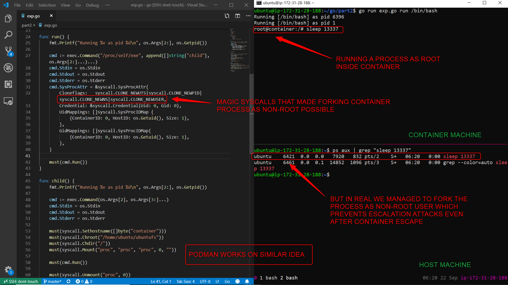

# containers-from-scratch

## Motivation

At the time of forking, Liz's containers-from-scratch project starts container with root privileges. That means, any process that is running with root privielges inside the container also runs with root privileges on host machine. This kind of behaviour causes a lot of security concerns.

This updated project contains code that allows you to start **"rootless container"** with just a few linux syscalls.

*Note that the Go code uses some syscall definitions that are only available when building with GOOS=linux.*

## Dependency

To start a containerized environment, you need a filesystem to mount. We will mount alpine filesystem to start our containerized environment. You can use any filesystem for that matter.

*Note: Alpine filesystem is already included in the project*

Download reference: http://dl-cdn.alpinelinux.org/alpine/v3.12/releases/x86_64/alpine-minirootfs-3.12.1-x86_64.tar.gz

## Execution

```
go run main.go run /bin/sh
```

## Rootless container in action




## Contributor

[Rewanth Cool](https://www.linkedin.com/in/rewanthcool/)
